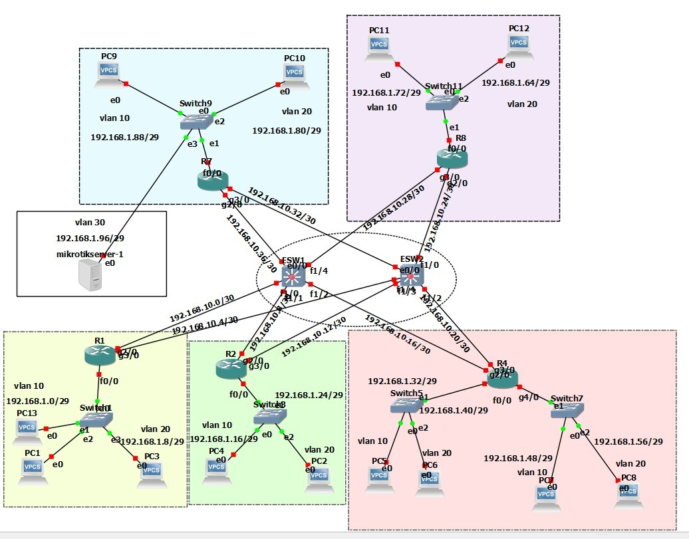

# Network Reporting System

## Brief Description / Project Purpose
This web application is designed to analyze and monitor a three-tier CAMPUS LAN enterprise network (access, distribution, and core) emulated in GNS3. It provides an interface to collect, analyze, and visualize network device information, including interface details, ARP tables, routing protocols (OSPF), hardware and software information, and CDP neighbor discovery.

### Network Topology

*Three-tier CAMPUS LAN topology implemented in the project*

## Table of Contents
- [Technologies Used](#technologies-used)
- [Project Structure](#project-structure)
- [Configuration](#configuration)
- [Data Flow](#data-flow)
- [Expected Results](#expected-results)
- [Screenshots](#screenshots)
- [To-Do / Future Improvements](#to-do--future-improvements)
- [Author](#author)

## Technologies Used
- **Backend:**
  - Python 3.x
  - Flask (Web Framework)
  - SQLServer (Database)
- **APIs and Protocols:**
  - RESTCONF
  - YANG data models
  - CDP (Cisco Discovery Protocol)
  - OSPF
- **Network Tools:**
  - GNS3
  - Cisco IOS XE
- **Others:**
  - JSON for data exchange
  - BFS Algorithm for topology discovery

## Project Structure
```
server/
├── src/
│   ├── app.py           # Main Flask application
│   ├── bfs.py           # BFS algorithm for topology
│   ├── controllers/     # Business logic
│   ├── model/          # Data models
│   ├── routers/        # API routes
│   ├── middlewares/    # Application middleware
│   ├── utils/          # Utility functions
│   ├── db/            # Database configuration
│   ├── static/        # Static files
│   └── templates/     # HTML templates
├── docs/
│   ├── sql/           # SQL database scripts
│   ├── topology/      # Topology documentation
│   └── jsons/        # JSON examples and results
```

## Configuration
1. Database Setup:
   - SQL scripts are located in `server/docs/sql/`
   - Execute scripts in order to create the necessary tables

## Data Flow
1. **Network Discovery:**
   - BFS algorithm starts from an initial device
   - Collects ARP and neighbor information
   - Builds topology map

2. **Data Collection:**
   - Network interfaces
   - ARP tables
   - CDP information
   - OSPF configuration
   - Hardware/software details

3. **Storage:**
   - Data is stored in SQL tables
   - Topology results are saved in JSON

## Expected Results
- Complete network topology map
- Detailed device information
- Interface and protocol status
- Device relationships (neighbors)
- Network metrics

## Screenshots

The system generates various reports showing detailed network information:

### Report 1: Network Node Overview

*General view of network topology and its main connections.*

### Report 2: Device Report

*General information about a device and its hardware*

#### Device Software and Interface Information

*Details about device software and its interfaces.*

#### Device ARP Table

*ARP table with physical addresses, IP, ARP type, and date*

#### CDP (Cisco Discovery Protocol) Neighbors Table

*Table with neighboring devices through CDP protocol*

### Report 6: OSPF Protocol Analysis

*Analysis of OSPF protocol in use.*

## Data Examples

The system collects detailed information from network devices through RESTCONF queries. Here are some examples of the data obtained:

### ARP Table
```json
{
    "Cisco-IOS-XE-arp-oper:arp-data": {
        "arp-vrf": [{
            "vrf": "Default",
            "arp-oper": [{
                "address": "192.168.10.5",
                "interface": "GigabitEthernet5",
                "mode": "ios-arp-mode-dynamic",
                "hardware": "0c:42:d7:e1:00:01",
                "time": "2024-04-29T13:39:32.000615+00:00"
            }]
        }]
    }
}
```

### Hardware Information
```json
{
    "Cisco-IOS-XE-device-hardware-oper:device-hardware-data": {
        "device-hardware": {
            "device-inventory": [{
                "hw-type": "hw-type-chassis",
                "part-number": "CSR1000V",
                "serial-number": "9D3WSC4GWGG",
                "hw-description": "Cisco CSR1000V Chassis"
            }],
            "device-system-data": {
                "current-time": "2024-04-30T15:41:02+00:00",
                "software-version": "Cisco IOS Software [Fuji], Virtual XE Software",
                "last-reboot-reason": "reload"
            }
        }
    }
}
```

### Native Configuration
```json
{
    "Cisco-IOS-XE-native:native": {
        "hostname": "nucleo2",
        "username": [{
            "name": "admin",
            "privilege": 15
        }],
        "interface": {
            "GigabitEthernet": [{
                "name": "1",
                "ip": {
                    "address": {
                        "primary": {
                            "address": "192.168.10.34",
                            "mask": "255.255.255.252"
                        }
                    }
                }
            }]
        }
    }
}
```

## To-Do / Future Improvements
- Implement user authentication
- Add LLDP support
- Implement real-time monitoring
- Integrate with external monitoring systems

## Author

**Jorge Infante Fragoso**

- 💻 GitHub: [@georgeif2212](https://github.com/georgeif2212)
- 💼 LinkedIn: [Jorge Infante - Computación](https://www.linkedin.com/in/jorgeinfante-computacion/)
- 📧 Email: jinfante2212@gmail.com

