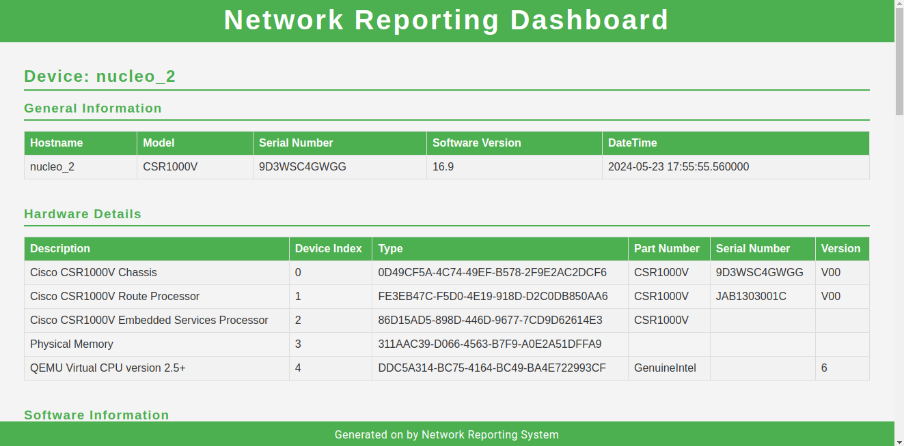

# Sistema de Reportes de Red

## Descripción breve / propósito del proyecto
Esta aplicación web está diseñada para analizar y monitorear una red empresarial CAMPUS LAN de tres capas (acceso, distribución y núcleo) emulada en GNS3. Proporciona una interfaz para recopilar, analizar y visualizar información de dispositivos de red, incluyendo detalles de interfaces, tablas ARP, protocolos de enrutamiento (OSPF), información de hardware y software, y descubrimiento de vecinos CDP.

### Topología de Red

*Topología CAMPUS LAN de tres capas implementada en el proyecto*

## Tabla de Contenidos
- [Tecnologías Usadas](#tecnologías-usadas)
- [Estructura del Proyecto](#estructura-del-proyecto)
- [Configuración](#configuración)
- [Flujo de Datos](#flujo-de-datos)
- [Resultados Esperados](#resultados-esperados)
- [Capturas de Pantalla](#capturas-de-pantalla)
- [To-Do / Mejoras Futuras](#to-do--mejoras-futuras)
- [Autor](#autor)

## Tecnologías Usadas
- **Backend:**
  - Python 3.x
  - Flask (Framework web)
  - SQLServer (Base de datos)
- **APIs y Protocolos:**
  - RESTCONF
  - YANG data models
  - CDP (Cisco Discovery Protocol)
  - OSPF
- **Herramientas de Red:**
  - GNS3
  - Cisco IOS XE
- **Otros:**
  - JSON para intercambio de datos
  - Algoritmo BFS para descubrimiento de topología

## Estructura del Proyecto
```
server/
├── src/
│   ├── app.py           # Aplicación principal Flask
│   ├── bfs.py           # Algoritmo de búsqueda BFS para topología
│   ├── controllers/     # Lógica de negocio
│   ├── model/          # Modelos de datos
│   ├── routers/        # Rutas de la API
│   ├── middlewares/    # Middleware de la aplicación
│   ├── utils/          # Funciones de utilidad
│   ├── db/            # Configuración de base de datos
│   ├── static/        # Archivos estáticos
│   └── templates/     # Plantillas HTML
├── docs/
│   ├── sql/           # Scripts SQL para la base de datos
│   ├── topology/      # Documentación de topología
│   └── jsons/        # Ejemplos y resultados JSON
```

## Configuración
1. Configurar la base de datos:
   - Los scripts SQL se encuentran en `server/docs/sql/`
   - Ejecutar los scripts en orden para crear las tablas necesarias

## Flujo de Datos
1. **Descubrimiento de Red:**
   - El algoritmo BFS comienza desde un dispositivo inicial
   - Recopila información ARP y de vecinos
   - Construye un mapa de topología

2. **Recopilación de Datos:**
   - Interfaces de red
   - Tablas ARP
   - Información CDP
   - Configuración OSPF
   - Detalles de hardware/software

3. **Almacenamiento:**
   - Los datos se almacenan en tablas SQL
   - Los resultados de topología se guardan en JSON

## Resultados Esperados
- Mapa de topología de red completo
- Información detallada de dispositivos
- Estado de interfaces y protocolos
- Relaciones entre dispositivos (vecinos)
- Métricas de red

## Capturas de Pantalla

El sistema genera varios reportes que muestran información detallada sobre la red:

### Report 1: Vista General de los nodos de la red

*Vista general de la topología de red y sus conexiones principales.*

### Report 2: Reporte por dispositivo

*Información general de un dispositivo y su hardware*

#### Información del software y las interfaces del dispositivo

*Detalles sobre el software del dispositivo y sus interfaces.*

#### Tabla ARP del dispositivo

*Tabla ARP con direcciones físicas, IP, tipo de arp y fecha*

#### Tabla de vecinos CDP (Cisco Discovery Protocol)

*Tabla con los dispositivos que son vecinos mediante el protocolo CDP*

### Report 6: Análisis de Protocolo OSPF

*Análisis del protocolo OSPF en uso.*

## Ejemplos de Datos

El sistema recopila información detallada de los dispositivos de red a través de consultas RESTCONF. Aquí hay algunos ejemplos de los datos obtenidos:

### Tabla ARP
```json
{
    "Cisco-IOS-XE-arp-oper:arp-data": {
        "arp-vrf": [{
            "vrf": "Default",
            "arp-oper": [{
                "address": "192.168.10.5",
                "interface": "GigabitEthernet5",
                "mode": "ios-arp-mode-dynamic",
                "hardware": "0c:42:d7:e1:00:01",
                "time": "2024-04-29T13:39:32.000615+00:00"
            }]
        }]
    }
}
```

### Información de Hardware
```json
{
    "Cisco-IOS-XE-device-hardware-oper:device-hardware-data": {
        "device-hardware": {
            "device-inventory": [{
                "hw-type": "hw-type-chassis",
                "part-number": "CSR1000V",
                "serial-number": "9D3WSC4GWGG",
                "hw-description": "Cisco CSR1000V Chassis"
            }],
            "device-system-data": {
                "current-time": "2024-04-30T15:41:02+00:00",
                "software-version": "Cisco IOS Software [Fuji], Virtual XE Software",
                "last-reboot-reason": "reload"
            }
        }
    }
}
```

### Configuración Native
```json
{
    "Cisco-IOS-XE-native:native": {
        "hostname": "nucleo2",
        "username": [{
            "name": "admin",
            "privilege": 15
        }],
        "interface": {
            "GigabitEthernet": [{
                "name": "1",
                "ip": {
                    "address": {
                        "primary": {
                            "address": "192.168.10.34",
                            "mask": "255.255.255.252"
                        }
                    }
                }
            }]
        }
    }
}
```

## To-Do / Mejoras Futuras
- Implementar autenticación de usuarios
- Agregar soporte para LLDP
- Implementar monitoreo en tiempo real
- Integrar con sistemas de monitoreo externos

## Autor

**Jorge Infante Fragoso**

- 💻 GitHub: [@georgeif2212](https://github.com/georgeif2212)
- 💼 LinkedIn: [Jorge Infante - Computación](https://www.linkedin.com/in/jorgeinfante-computacion/)
- 📧 Correo: jinfante2212@gmail.com 